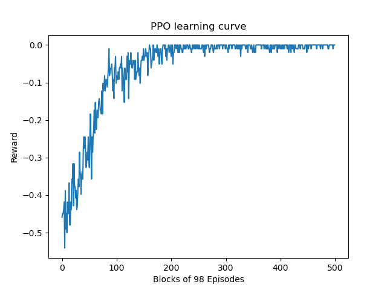

Reinforcement Learning for Board Games
======================================

PPO Gym for TicTacToe
---------------------

100 k timesteps against a heuristic agent:

Final result: Out of 1000 episodes: Wins=0, Draws=1000, Losses=0

Development environment
-----------------------

Set up: `mamba env create -f environment.yml`

Activate: `conda activate reinforcement`
